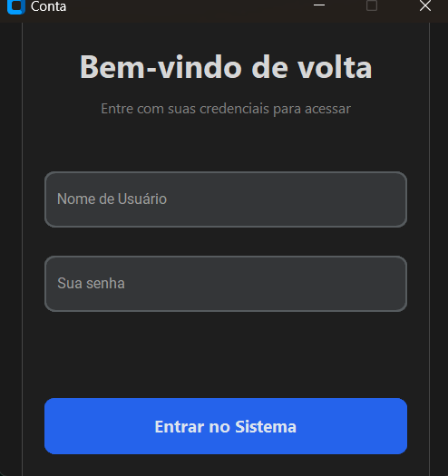
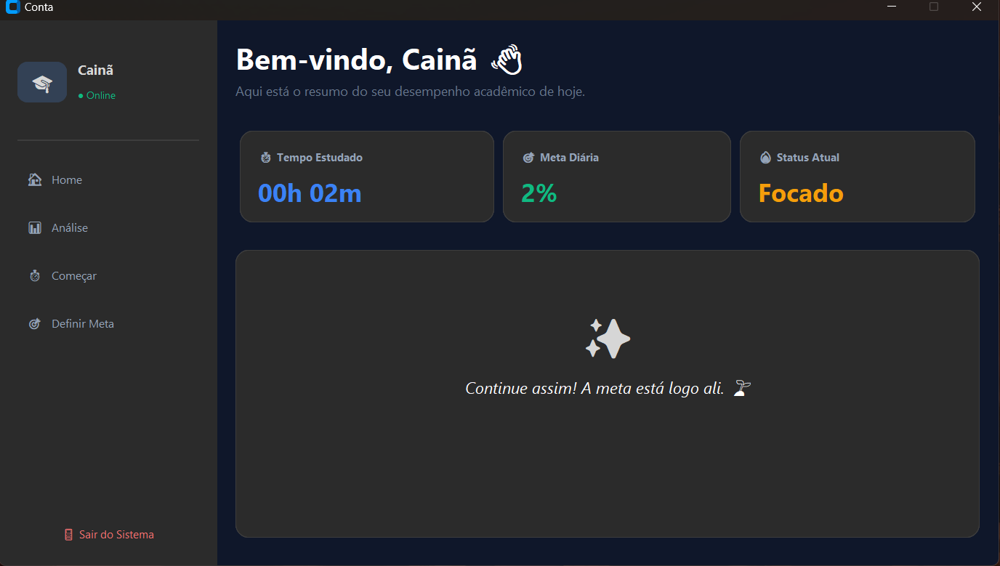
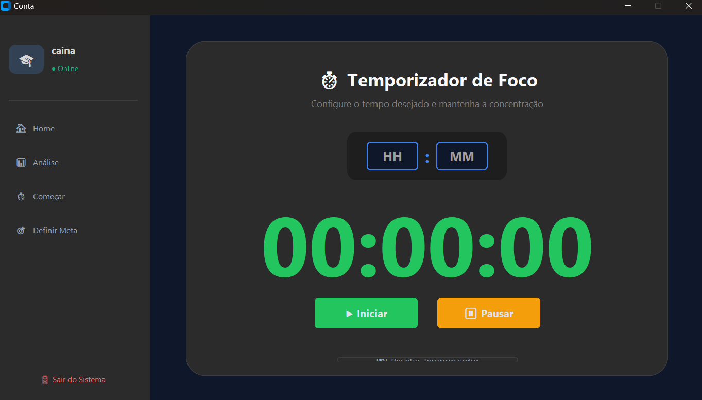
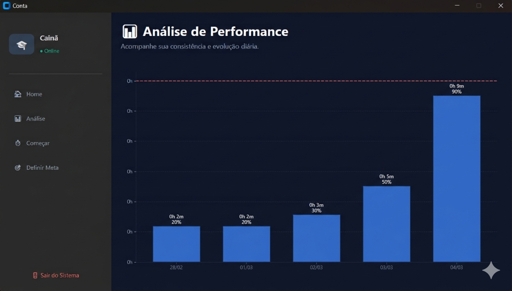

# ⏱️ StudyApp - Gestão de Performance e Foco

> **Transforme seu tempo de estudo em dados acionáveis com uma interface moderna e intuitiva.**

O **StudyApp** é uma aplicação desktop desenvolvida em Python para auxiliar estudantes e profissionais a monitorar seus ciclos de foco. O grande diferencial do projeto é a sua **análise gráfica de alta precisão**, que adapta as escalas de tempo de forma inteligente para oferecer uma visão clara do progresso diário, independentemente se você estudou por 10 minutos ou 10 horas.

---

## 📸 Demonstração do Sistema

### 🔐 Interface de Login
Uma porta de entrada segura e moderna, com autenticação integrada ao banco de dados local.



Home



### ⏳ Cronômetro de Foco
Controle em tempo real com feedback visual imediato. O cronômetro permite pausar e retomar sessões, garantindo precisão total no registro.



### 📊 Gráfico de Performance (Eixo Y Dinâmico)
O coração da análise de dados do app. O gráfico utiliza lógica avançada para dividir o tempo em 10 etapas exatas.



---

## ✨ Funcionalidades Principais

* **Controle de Tempo:** Inicie, pause e pare sessões de estudo com um clique.
* **Metas Personalizáveis:** Defina sua meta diária e visualize a linha de corte diretamente no gráfico.
* **Régua de 10 Etapas:** O eixo Y é dividido automaticamente em 10 intervalos iguais, facilitando a leitura de frações de tempo (ex: de 6 em 6 minutos).
* **Formatação Inteligente:** O sistema remove automaticamente o prefixo "0h" para tempos curtos, exibindo rótulos como `20m`, `45m` ou `1h 15m`.
* **Feedback por Cores:** As barras do gráfico mudam de cor (Verde para meta atingida, Azul para progresso em andamento).
* **Banco de Dados Local:** Armazenamento persistente com SQLite3, garantindo que seus dados não sejam perdidos ao fechar o programa.

---

## 🛠️ Tecnologias e Conceitos Aplicados

* **Linguagem:** `Python 3.10+`
* **Interface Gráfica (GUI):** `CustomTkinter` — Design moderno com suporte nativo a Dark Mode.
* **Visualização de Dados:** * `Matplotlib`: Renderização de gráficos de alta qualidade.
    * `NumPy`: Cálculos vetoriais e geração de intervalos numéricos precisos (`linspace`).
* **Persistência de Dados:** `SQLite3` — Gerenciamento de banco de dados relacional leve e embutido.
* **Arquitetura:** Organização modular do código (Lógica, UI e Database segregados).

---

## 🚀 Como Executar o Projeto

### 1. Pré-requisitos
Certifique-se de ter o Python instalado em sua máquina. Clone este repositório e instale as dependências necessárias:

```bash
# Clone o repositório
git clone [https://github.com/seu-usuario/StudyApp.git](https://github.com/seu-usuario/StudyApp.git)

# Instale as bibliotecas
pip install customtkinter matplotlib numpy
